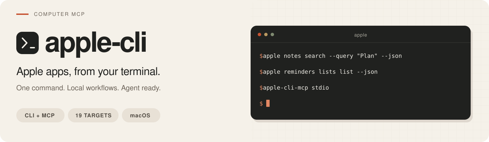

# apple-cli

Apple apps, from your terminal. `apple-cli` brings 19 Apple app and system
targets to one macOS command, with structured JSON output and an optional MCP
server for local agents.

[Install](#install) · [Quick start](#quick-start) · [Targets](#targets) ·
[MCP](#mcp) · [Documentation](#documentation)

> **Alpha preview · macOS arm64.** Feature availability depends on the target,
> OS, account and permissions. See the [Release Guide](Documentation/Reference/ReleaseGuide.md)
> for the tested build environment and installation details.

- **Script everyday workflows.** Search Notes, organize Reminders, inspect
  calendars, query Photos and work with local files.
- **Use predictable output.** JSON results, stable error codes and bounded
  reads make commands usable in scripts.
- **Connect your agent.** The MCP server exposes the same CLI capabilities
  through stdio or Streamable HTTP.

~~~text
apple <target> <resource?> <action> [options]
~~~

## Install

Download the macOS arm64 archive and its checksum from
[GitHub Releases](https://github.com/computer-mcp/apple-cli/releases).
Release archives are built, tested and published by GitHub Actions.

For `0.1.0-alpha.1`, run these commands in the download directory:

~~~bash
shasum -a 256 -c apple-cli-0.1.0-alpha.1-macos-arm64.tar.gz.sha256
tar -xzf apple-cli-0.1.0-alpha.1-macos-arm64.tar.gz
export PATH="$PWD/apple-cli-0.1.0-alpha.1-macos-arm64/bin:$PATH"
apple --version
~~~

Keep the complete `bin` directory together: `apple`, `apple-cli-mcp` and any
bundled Swift runtime libraries. The [Release Guide](Documentation/Reference/ReleaseGuide.md#install-the-archive)
covers relocation, signatures and compatibility.

### Build from source

Use macOS with an Xcode toolchain providing Swift 6.3 or newer and the Notes
private frameworks required by the package. From the repository root:

~~~bash
Scripts/bootstrap
xcrun swift build --force-resolved-versions
.build/debug/apple --help
~~~

Rerun `Scripts/bootstrap` after changing Xcode or the SDK. The declared
macOS 13 deployment floor is a build setting; runtime support requires
validation on the intended OS and architecture.

## Quick start

Discover a target and check its readiness:

~~~bash
apple --help
apple notes --help
apple notes doctor --json
~~~

Read app data with explicit queries and limits:

~~~bash
apple notes search --query "Plan" --limit 20 --json
apple reminders lists list --json
apple calendar calendars list --json
apple photos media-items search --keyword travel --limit 20 --json
~~~

Preview a reminder before creating it. Replace `Today` with an existing list:

~~~bash
apple reminders create \
  --list Today \
  --title "Follow up" \
  --dry-run \
  --json
~~~

An explicit create request can then run with the same list and title:

~~~bash
apple reminders create --list Today --title "Follow up" --json
~~~

### Structured output

`--json` returns an envelope with `ok` and `data`. Errors use `ok: false` and a
stable `error.code`. Add `--pretty` for readable formatting.

This preview works without accessing app data or sending a notification:

~~~bash
apple notifications preview --title Build --body Done --json --pretty
~~~

~~~json
{
  "data": {
    "externalAction": false,
    "notification": {
      "body": "Done",
      "title": "Build"
    }
  },
  "meta": {
    "target": "notifications"
  },
  "ok": true,
  "warnings": []
}
~~~

## Targets

Choose a target to open its user guide:

| Workflow | Targets |
| --- | --- |
| Notes and planning | [`notes`](Documentation/Reference/Notes/UserGuide.md) · [`reminders`](Documentation/Reference/Reminders/UserGuide.md) · [`calendar`](Documentation/Reference/Calendar/UserGuide.md) · [`contacts`](Documentation/Reference/Contacts/UserGuide.md) |
| Communication | [`mail`](Documentation/Reference/Mail/UserGuide.md) · [`messages`](Documentation/Reference/Messages/UserGuide.md) · [`facetime`](Documentation/Reference/FaceTime/UserGuide.md) |
| Browsing, media and files | [`safari`](Documentation/Reference/Safari/UserGuide.md) · [`maps`](Documentation/Reference/Maps/UserGuide.md) · [`photos`](Documentation/Reference/Photos/UserGuide.md) · [`finder`](Documentation/Reference/Finder/UserGuide.md) |
| Documents | [`pages`](Documentation/Reference/Pages/UserGuide.md) · [`numbers`](Documentation/Reference/Numbers/UserGuide.md) · [`keynote`](Documentation/Reference/Keynote/UserGuide.md) |
| System utilities | [`print`](Documentation/Reference/Print/UserGuide.md) · [`clipboard`](Documentation/Reference/Clipboard/UserGuide.md) · [`notifications`](Documentation/Reference/Notifications/UserGuide.md) · [`intelligence`](Documentation/Reference/Intelligence/UserGuide.md) · [`tcc`](Documentation/Reference/TCC/UserGuide.md) |

Coverage varies by target. Pages and Keynote focus on metadata and export;
Numbers supports reads, exports and single-cell writes. Safari Tab Group
mutations and some Notes media workflows return an explicit unsupported result.
Read the [Capability List](Documentation/Architecture/CapabilityList.md) for
the supported scope of each target.

## MCP

`apple-cli-mcp` connects local MCP clients to the `apple` CLI. Configure your
client with the full path to the installed executable and `stdio` as its
argument:

| Client setting | Value |
| --- | --- |
| Command | `/path/to/extracted-release/bin/apple-cli-mcp` |
| Arguments | `stdio` |

To start the server directly:

~~~bash
apple-cli-mcp stdio
~~~

The adapter finds `apple` beside its own executable. Keep both programs and
the bundled runtime libraries together. For a separate CLI directory, set
`APPLE_CLI_BIN_DIR` to the directory containing `apple`.

Streamable HTTP is also available on loopback:

~~~bash
apple-cli-mcp serve http --host 127.0.0.1 --port 8765 --path /mcp
~~~

The same target permissions and mutation gates apply through MCP. See
[MCP setup](Documentation/Reference/AppleCLIUserGuide.md#mcp-setup) for discovery,
remote access and authentication.

The source tree also includes a [Reminder Creator skill](skills/reminder-creator/SKILL.md)
for modeling reminder content, lists, sections and shopping workflows.
See its [shopping reference](skills/reminder-creator/references/shopping-list.md)
for scenario guidance.

## Permissions and writes

Start with `apple <target> doctor --json` when a target cannot access an app
or its data. Some workflows need macOS permissions or app automation approval.

Use `--dry-run` to inspect a proposed mutation. External dispatch, destructive
selections and system operations require the specific `--allow-*` flag named
by the command. `--json` controls output; authorization comes from the requested
operation and its gates. See [Safety Gates](Documentation/Reference/SafetyGates.md)
for the full contract.

## Development

~~~bash
Scripts/bootstrap
xcrun swift test --force-resolved-versions
Scripts/validate-public-content
~~~

The default suite uses fixtures and controlled backends. Real app behavior,
accounts and OS compatibility need separate validation; the
[Release Guide](Documentation/Reference/ReleaseGuide.md#build-from-source)
describes the available integration checks.

## Documentation

| Start here | What it covers |
| --- | --- |
| [User guide](Documentation/Reference/AppleCLIUserGuide.md) | Discovery, output, permissions, MCP and workflow safety |
| [Target guides](Documentation/README.md#target-guides) | User and developer documentation for all 19 targets |
| [Release guide](Documentation/Reference/ReleaseGuide.md) | Installation, CI publication and compatibility |
| [Version rules](Documentation/Architecture/VersioningAndRelease.md) | Version upgrades, prereleases and release evidence |
| [Architecture](Documentation/Architecture/README.md) | CLI ownership, implementation mechanisms and MCP boundaries |
| [Contributing](CONTRIBUTING.md) | Repository conventions and validation |
| [Security](SECURITY.md) | Vulnerability reporting |

## License

Copyright (c) 2026 Xudong Xu. Licensed under the [Apache License 2.0](LICENSE).
Third-party components retain their own licenses; see
[Third-Party Notices](THIRD_PARTY_NOTICES.md).
